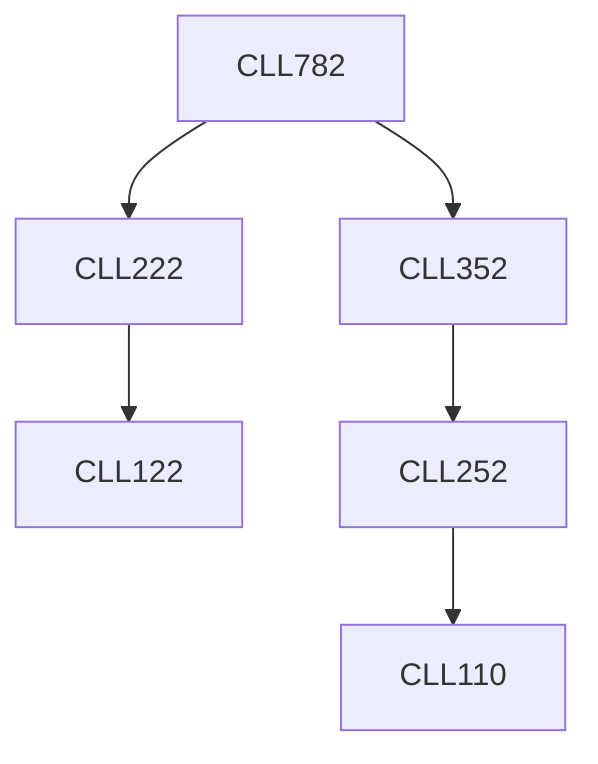

**Credits:** 3 (3-0-0)

**Prerequisites:** [[/Chemical Engineering/CLL222 | CLL222]], [[/Chemical Engineering/CLL352 | CLL352]]

**Overlaps with:** MTL103, MTL625, MTL704, APL771, MCL742

#### Description 
Introduction to optimization and applications; classification (LP, NLP, MILP, MINLP), convexity, unimodal vs multimodal. Single variable and multivariable unconstrained optimization methods. Linear programming, branch and bound method for MILP. Constrained optimization: nonlinear programming. Necessary and sufficient conditions of optimality. Quadratic programming. Case studies from chemical industry.

### Prerequisite Tree

