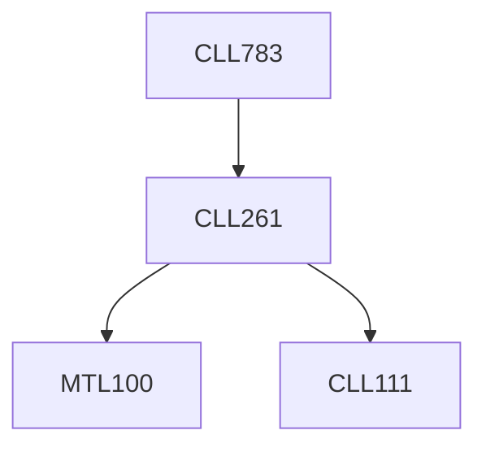

**Credits:** 3 (3-0-0)

**Prerequisites:** [[/Chemical Engineering/CLL261|CLL261]]

**Overlaps with:** ELL325, ELL723, BBL444

#### Description
State-space models. Distributed parameter models. Feedforward control. Ratio control. Dead-time compensation. Relative gain array. Z-transforms and digital control. Internal model control. State estimation and process identification. Adaptive control. Non-linear control. Model-based control structures. Synthesis of control systems with case studies. Intelligent control, model predictive control.

### Prerequisite Tree

