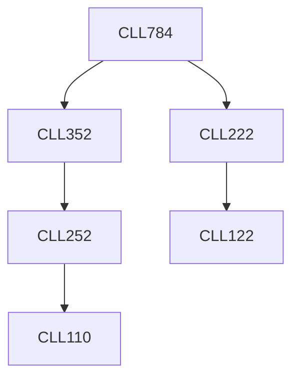

**Credits:** 3 (3-0-0)

**Prerequisites:** [[/Chemical Engineering/CLL222|CLL222]], [[/Chemical Engineering/CLL352|CLL352]]

#### Description
Introduction to modeling, physical and mathematical models, modeling individual units vs. process. Role of simulation and simulators. Sequential and modular approaches to flowsheet simulation: equation solving approach. Decomposition of networks: tearing algorithms, convergence promotion.

Specific purpose simulation. Dynamic simulation. Case studies using commercial or open source simulation packages.

### Prerequisite Tree

