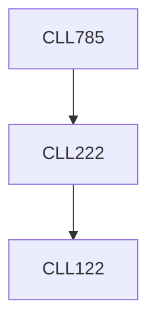

**Credits:** 3 (3-0-0)

**Prerequisites:** [[/Chemical Engineering/CLL222|CLL222]]

**Overlaps with:** MTL720

#### Description
Traditional vs. nontraditional optimization techniques. Population based search algorithms. Evolutionary strategies. Simulated annealing. Genetic algorithms. Differential evolution. Different strategies of differential evolution. Memetic algorithms. Scatter, Tabu search. Ant-colony optimization. Particle swarm optimization. Self-organizing migrating algorithm. Neural networks. Quantum computing. DNA computing. Multi-objective optimization. Industrial applications.

### Prerequisite Tree

