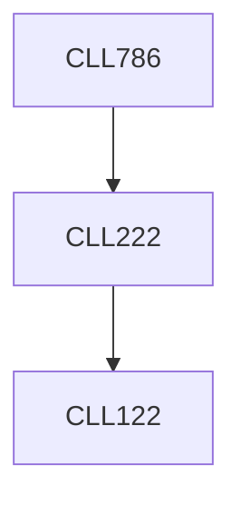

**Credits:** 3 (3-0-0)

**Prerequisites:** [[/Chemical Engineering/CLL222|CLL222]]

#### Description
Introduction to fine and high value chemicals. Historical perspectives. Synthesis methods from chemical (petrochemicals and natural products) and biotechnology routes (enzymatic methods, fermentation and cell culture technology). Extraction of fine chemicals from microorganisms, plant sources and animal sources. Chromatographic separations. Reactor technology for fine chemicals. Scale-up and scale-out of reactors. Microreactor technology and process intensification. Novel high value chemicals for adhesives, electronic materials, food additives, specialty polymers, flavours and fragrances.

### Prerequisite Tree

