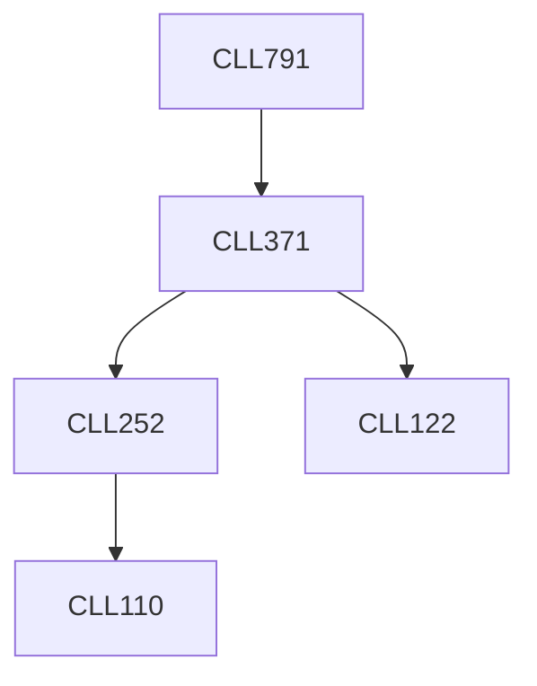

**Credits:** 3 (3-0-0)

**Prerequisites:** [[/Chemical Engineering/CLL371|CLL371]]

#### Description
The course will be a structured project based course with initial exposure to industrial processes of understanding Voice of Customers, identifying design specifications, scoping the technology and product landscape and deciding on the technology strategy. Technical and economic feasibility analysis as well as scale-up and manufacturing concerns will also be discussed. Each group will identify a specific product or process of interest and work through these considerations as well as integrate thermodynamics, transport principles, fluid mechanics and reactor design understanding to design the product or process chosen.

### Prerequisite Tree

