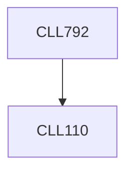

**Credits:** 3 (3-0-0)

**Prerequisites:** [[/Chemical Engineering/CLL110|CLL110]]

**Overlaps with:** MTL766, MAL719, SML802

#### Description
Design of experiments - factors, responses, main effects, interactions, different kinds of designs - screening vs. high resolution. Statistical data analysis - applied probability, sampling, estimation, hypothesis testing, linear regression, analysis of variance, types of data plots. Technology transfer of processes
- need of technology transfer, key attributes, key challenges, solutions to various issues. Intellectual property management
- intellectual property rights, IPR laws, patents, trademarks, designs, copyrights, licensing, IP management. Commercialization of technologies - invention, product development, technical and market feasibility analysis, intellectual property acquisition.

### Prerequisite Tree

