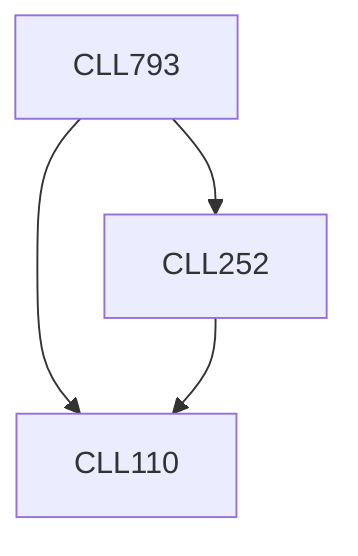

**Credits:** 3 (3-0-0)

**Prerequisites:** [[/Chemical Engineering/CLL110 | CLL110]], [[/Chemical Engineering/CLL252 | CLL252]]

#### Description 
Introduction to membrane separation processes, their classification, and applications. General transport theories including theory of irreversible thermodynamics for multicomponent systems. Membrane preparation techniques. Design and analysis and industrial application of various membrane processes such as reverse osmosis, ultra filtration, electrodialysis, dialysis, liquid membrane separation, gas permeation and pervaporation.

### Prerequisite Tree

