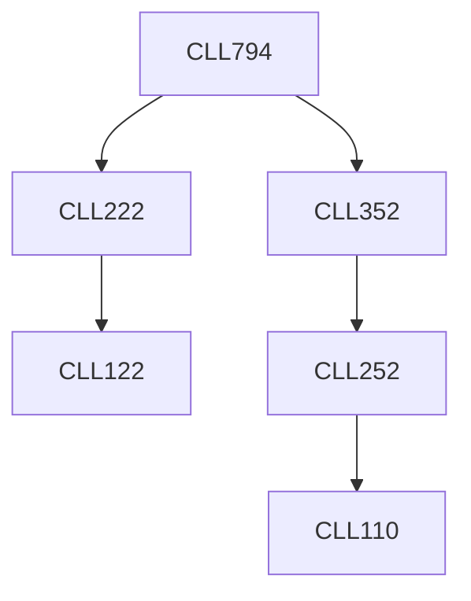

**Credits:** 3 (3-0-0)

**Prerequisites:** [[/Chemical Engineering/CLL222 | CLL222]], [[/Chemical Engineering/CLL352 | CLL352]]

#### Description 
Composition of petroleum, laboratory tests, refinery products, characterization of crude oil. Design of crude oil distillation column. Catalytic cracking, catalytic reforming, delayed coking, furnace design, hydrogenation and hydrocracking, isomerization, alkylation and polymerization. Lube oil manufacturing. Energy conservation in petroleum refineries. New trends in petroleum refinery operations. Pyrolysis of naphtha and light hydrocarbons.

### Prerequisite Tree

