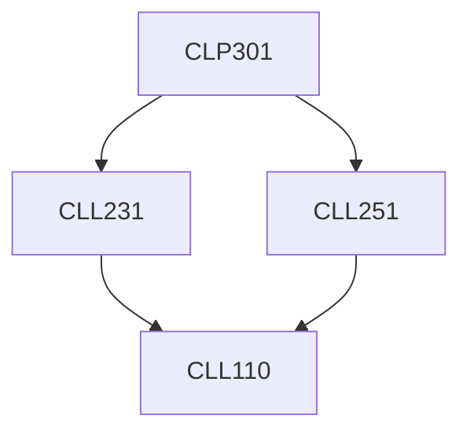

**Credits:** 1.5 (0-0-3)

**Prerequisites:** [[/Chemical Engineering/CLL231 | CLL231]], [[/Chemical Engineering/CLL251 | CLL251]]

#### Description 
Practicals in fluid mechanics and heat transfer.

### Prerequisite Tree

