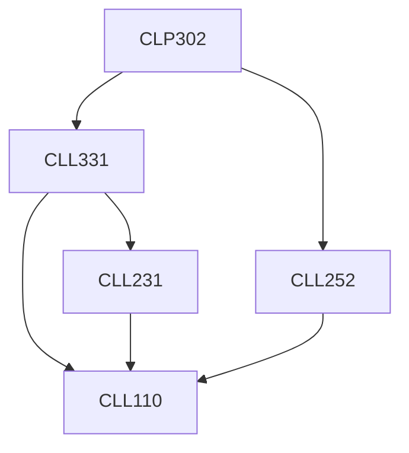

**Credits:** 1.5 (0-0-3)

**Prerequisites:** [[/Chemical Engineering/CLL331 | CLL331]], [[/Chemical Engineering/CLL252 | CLL252]]

#### Description 
Practicals in unit operations, mechanical operations, fluid-particle mechanics and principles of mass transfer.

### Prerequisite Tree

