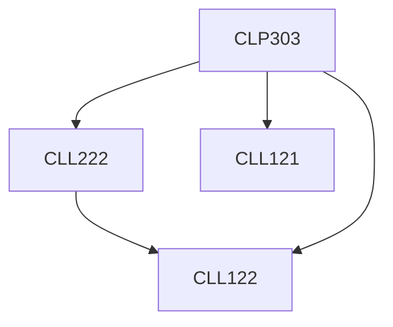

**Credits:** 1.5 (0-0-3)

**Prerequisites:** [[/Chemical Engineering/CLL121|CLL121]], [[/Chemical Engineering/CLL122|CLL122]], [[/Chemical Engineering/CLL222|CLL222]]

#### Description
Practicals in reaction engineering, thermodynamics and chemical processing.

### Prerequisite Tree

