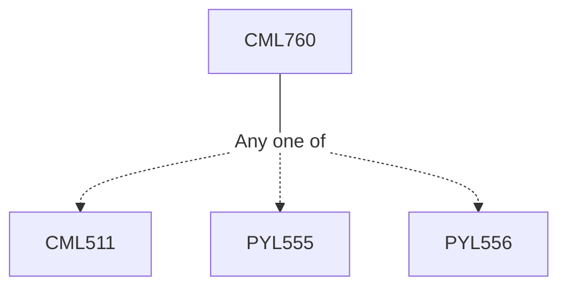

**Credits:** 3 (2-0-2)

**Prerequisites:** [[/Chemistry/CML511|CML511]] or [[/Physics/PYL555|PYL555]] or [[/Physics/PYL556|PYL556]] or equivalent

#### Description
Overview of quantum chemistry, variational principle and its applications, Hartree-Fock method, density functional calculations, perturbation theory, configuration interactions, multi-configurational self-consistent field (MCSCF), Quantum chemical calculations, chemical reaction pathways, excited state calculations, calculations of spectral properties, ab initio molecular dynamics simulations

### Prerequisite Tree

