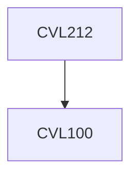

**Credits:** 4 (3-0-2)

**Prerequisites:** [[/Civil Engineering/CVL100|CVL100]]

#### Description
Water and wastewater treatment overview; Unit processes: systems of water purification, processes (sedimentation, coagulation-flocculation, softening, disinfection, adsorption, ion exchange, filtration) and kinetics in unit operation of water purification-theory and design aspects; distribution of water layout systems: design aspects; Wastewater engineering: systems of sanitation, wastewater collection systems design and flows,; Characteristics and microbiology of wastewater, BOD kinetics; Unit processes for wastewater treatment (screening, sedimentation; biological aerobic and anaerobic process)-theory and design aspects; Biological processes (Nutrient and phosphorous removal); advanced wastewater treatment- theory and design aspects; Air pollution (health effects, regulatory standards, dispersion; stacks, control systems); Municipal solid waste management; Noise pollution.

### Prerequisite Tree

