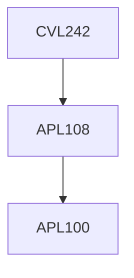

**Credits:** 3 (3-0-0)

**Prerequisites:** [[/Applied Mechanics/APL108|APL108]]

#### Description
General Concept of Static Equilibrium of Structures, Concept of Free Body Diagram, Analysis of Statically Determinate Trusses, Energy Methods for Determination of Joint Displacements - Castiliagno Theorem, Unit Load Method etc., Introduction to Analysis of Statically Indeterminate Trusses using Energy Methods, Analysis Statically Determinate Beams - Moment Area Theorem, Conjugate Beam Method, Maxwell Betti Theorem, Method of Superposition, Application of Energy Methods to Statically Determinate Beams and Rigid Frames, Solving Simple Indeterminate Beams Structures using Energy Methods, Analysis of Rolling Loads and Influence Line Diagram, Analysis of Arches and cable structures.

### Prerequisite Tree

