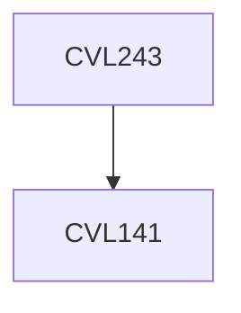

**Credits:** 3 (3-0-0)

**Prerequisites:** [[/Civil Engineering/CVL141|CVL141]]

#### Description
Design Philosophy: Working stress and limit state design concepts; Design of and detailing of RC beam sections in flexure, shear, torsion and bond; Design for serviceability; Design of RC beams, One way and two way RC slabs, RC short and long columns, RC footings.

### Prerequisite Tree

