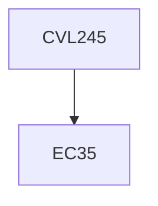

**Credits:** 2 (2-0-0)

**Prerequisites:** EC35

#### Description
Introduction to construction projects, stakeholders, phases in a project, Cost estimation from clients perspective, Project selection using time value of money concept, construction contract, cost estimate –contractors perspective, Project planning and network analysis-PERT, CPM, and Precedence Network, Resource scheduling, Time Cost trade off, Time -cost monitoring and control using S-curve and earned value analysis, Construction claims and disputes, and introduction to construction quality and safety.

### Prerequisite Tree

