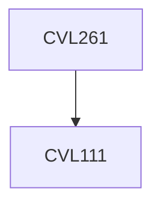

**Credits:** 3 (3-0-0)

**Prerequisites:** [[/Civil Engineering/CVL111|CVL111]]

#### Description
Transportation systems and their classification; Role of transportation with respect to socio-economic conditions; Transportation planning process; Road user and the vehicle; Geometric design of roads: horizontal alignment, vertical alignment, cross-section elements; Relevant geometric design standards; Pavements: flexible and rigid; Characterization of pavement materials; Analysis and design of pavement systems; Pavement design specifications; Pavement construction process; Pavement performance; Traffic engineering: Traffic characteristics; Fundamental relationships; Theories of traffic flow; Intersection design; Design of traffic signs and signals; Highway capacity.

### Prerequisite Tree

