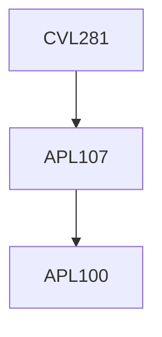

**Credits:** 4 (3-1-0)

**Prerequisites:** [[/Applied Mechanics/APL107|APL107]]

#### Description
Open Channel Flow: Channel Characteristics and parameters, Uniform flow, Critical flow, Specific Energy concepts, Gradually Varied Flows, Rapidly Varied flow with special reference to hydraulic jump, Unsteady flow in open channels.

Boundary Layer Theory: Navier Stokes Equation, Boundary Layer Equation in 2-dimension, Boundary layer characteristics, Integral Momentum equation, onset of turbulence, properties of turbulent flow, skin friction,application of drag, lift and circulation to hydraulic problems.

Pipe Flow: Laminar and Turbulent flow in Smooth and Rough pipes, pipe network analysis, Losses in pipes Fluvial Hydraulics: Settling velocity, Incipient motion, Resistance to flow and bed forms, Sediment load and transport.

### Prerequisite Tree

