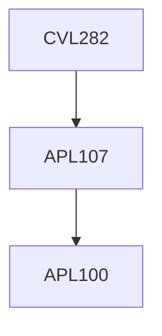

**Credits:** 4 (3-0-2)

**Prerequisites:** [[/Applied Mechanics/APL107 | APL107]]

#### Description 
Hydrologic Cycle, Processes and Applied Methodologies. Rainfall;

Evapotranspiration; Infiltration;

Groundwater: Occurrence, Movement, Governing equations, Well hydraulics.

Runoff: Hydrograph, Unit Hydrographs; Streamflow measurement. Flood Routing: Hydrological routing for reservoirs and channels. Frequency Analysis.

### Prerequisite Tree

