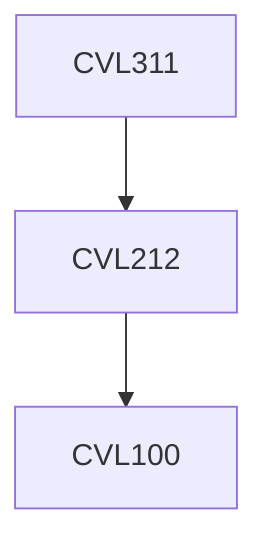

**Credits:** 3 (3-0-0)

**Prerequisites:** [[/Civil Engineering/CVL212|CVL212]]

#### Description
Industrial waste types and characteristics; levels of environmental pollution due to industrial wastes; health issues due to industrial wastes; ecological and human health risk assessment due to industrial wastes; waste characterization methods; treatment methods-conventional and recent trends (for air, water, soil media); Prevention versus control of industrial pollution; hierarchy of priorities for industrial waste management; comparison of real-life industrial waste management practices (ex: superfund remedial sites, etc.); economics of industrial waste management and sustainability issues; environmental rules and regulations; clean up goals;disposal/reuse of treated wastes; Source reduction and control of industrial water and air pollution; Minimization of industrial solid and hazardous waste; Waste management case studies from various industries.

### Prerequisite Tree

