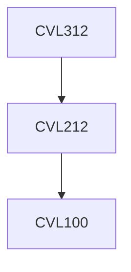

**Credits:** 3 (3-0-0)

**Prerequisites:** [[/Civil Engineering/CVL212|CVL212]]

#### Description
Environmental issues related to developmental activities: Nature and characteristics of environmental impacts of urban and industrial developments.

Linkages between technology, environmental quality, economic gain, and societal goals.

Environmental indices and indicators for describing affected environment. Methodologies and environmental systems modeling tools for prediction and assessment of impacts on environmental quality (surface water, ground water, air, soil).

Monitoring and control of undesirable environmental implications. Environmental cost benefit analysis. Decision methods for evaluation of environmentally sound alternatives.

Environmental health and safety: Basic concepts of environmental risk and definitions; Hazard identification procedures; Consequence analysis and modeling (discharge models, dispersion models, fire and explosion models, effect models etc.).

Emerging tools for environmental management: Environmental Management Systems, Environmentally sound technology transfer, emission trading, international resource sharing issues, climate change, international environmental treaties and protocols. Case studies.

### Prerequisite Tree

