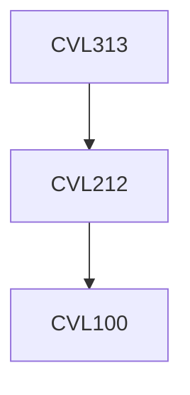

**Credits:** 3 (3-0-0)

**Prerequisites:** [[/Civil Engineering/CVL212|CVL212]]

#### Description
Definitions, source and types of air and noise pollution, physical and chemical properties of air pollutants, secondary pollutants formation, instrument design and industrial application, gas phase adsorption and biofiltration, carbon Credit, global warming potential, case studies, data analysis, interpretation.

### Prerequisite Tree

