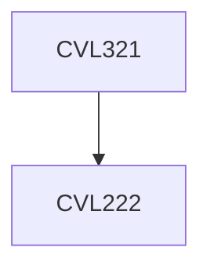

**Credits:** 4 (3-1-0)

**Prerequisites:** [[/Civil Engineering/CVL222|CVL222]]

#### Description
Foundations: types, selection and design considerations; Bearing capacity of shallow foundations: Terzaghi theory, factors affecting; Bearing capacity of deep foundations: single pile analysis, pile tests, pile driving formula, group capacity, introduction to laterally loaded piles; Settlement of shallow and deep foundations: stress distribution, immediate and consolidation settlements; Slope stability analysis: infinite slopes, method of slices, Swedish circle method; Earth dams: types and design aspects; Earth pressure analysis: Rankine and Coulomb methods; Earth retaining structures: types, design aspects, underground structures; Earthquake geotechnics: evaluation of liquefaction potential, seismic slope stability, seismic bearing capacity; Machine foundations: types, analysis, design procedure; Ground improvement techniques: types, deep stabilization, anchorage, grouting; Geosynthetics: types, functions, properties; reinforced soil walls; Geoenvironment: Landfills - types, liner, cover, stability; Ash ponds - stage raising, design aspects.

### Prerequisite Tree

