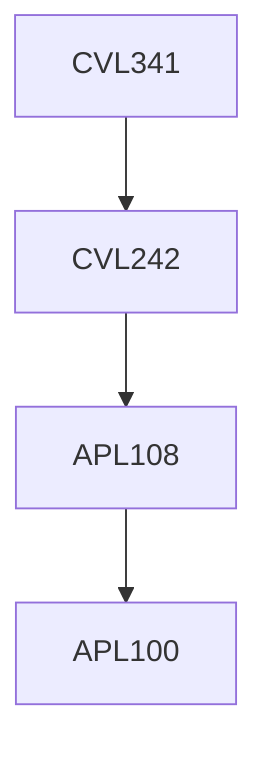

**Credits:** 3 (3-0-0)

**Prerequisites:** [[/Civil Engineering/CVL242|CVL242]]

#### Description
Determinacy and stability; Method of consistent deformations- Matrix formulation, Application to beams, trusses and frames; Slope-deflection method and Moment-distribution method- Beams and frames with uneven loading, support settlements, dealing with symmetry and anti-symmetry, Non-sway and sway frames; Matrix stiffness method; Matrix flexibility method; Energy methods; Approximate methods of analysis; Direct stiffness method for computer applications including computational aspects and MATLAB Assignments.

### Prerequisite Tree

