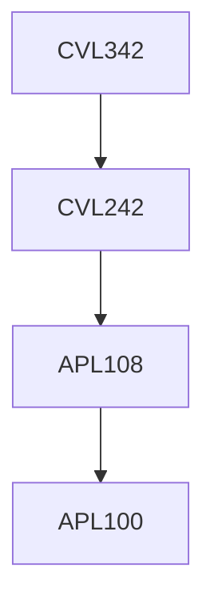

**Credits:** 3 (3-0-0)

**Prerequisites:** [[/Civil Engineering/CVL242|CVL242]]

#### Description
Structural steel and properties, Design pholisophy-Working stress and limit state; Connection types- Riveted, bolted and welded; Design of tension, compression and flexural members; Design of members subjected to combined loadings-Axial and bending, Torsion, Biaxial bending; Column bases, Gantry and plate girders; Roof trusses; Plastic design; Introduction to stability concepts, Design of shed- type structures.

### Prerequisite Tree

