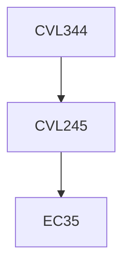

**Credits:** 3 (3-0-0)

**Prerequisites:** [[/Civil Engineering/CVL245|CVL245]]

#### Description
Additional network analysis- Ladder Network, LoB,etc., Time constrained Resource allocation and resource constrained problems, Time Cost trade off, project updating and control using EVM, Construction contracts and its types, tendering procedure, estimation and fixing of markup, bidding models, claims compensation and disputes, dispute resolution models, FIDIC contracts, Linear programming, Problems in construction, Formulation, Graphical solution, Simplex method, Dual problem, sensitivity analysis and their application to Civil engineering, Transportation Assignment problems and their applications

### Prerequisite Tree

