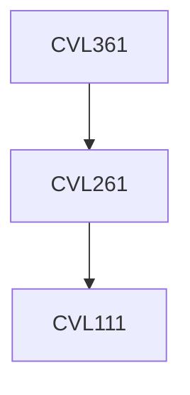

**Credits:** 3 (3-0-0)

**Prerequisites:** [[/Civil Engineering/CVL261|CVL261]]

#### Description
History: Indian railways, international perspective; Railway track gauge: factors affecting gauge choice, multi gauge; New project planning and surveys; Alignment of railway track; Structure of railway track: rails, sleepers, ballast, subgrade, track fittings; Structural design of railway track: stresses, creep; Geometric design of rail track: gradients, curves, superelevation; Locomotives and rolling stock: resistance and tractive power; Points and crossings; Railway stations and yards; Traffic control; Signalling and interlocking; Public rail transportation in metros.

### Prerequisite Tree

