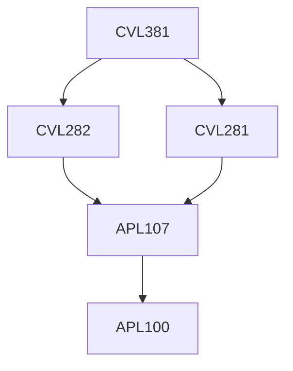

**Credits:** 4 (3-0-2)

**Prerequisites:** [[/Civil Engineering/CVL281 | CVL281]] and [[/Civil Engineering/CVL282 | CVL282]] Input studies.

#### Description 
Storage structures: Dams and reservoirs, Different types of dams and selection of suitable type and dam site, Gravity dam, Embankment dams. Diversion works: Design concepts for irrigation structures on permeable foundations, Design of Weirs and barrages. Design of energy dissipation devices. Canals: canal layout, Regime canal design, Rigid boundary canal design. Design of canal falls. Design of cross drainage works. Design of head regulator, cross regulator and canal outlet structures.

### Prerequisite Tree

