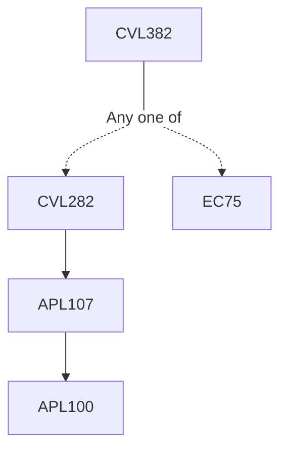

**Credits:** 2 (2-0-0)

**Prerequisites:** [[/Civil Engineering/CVL282 | CVL282]] or EC 75

#### Description 
Introduction, importance and occurrence of groundwater; Aquifers and groundwater scenario in India; Surface and subsurface investigation of groundwater; Construction, development and maintenance of wells; Flow through porous media, Darcy’s law, regional flow; Well hydraulics; Groundwater management.

### Prerequisite Tree

