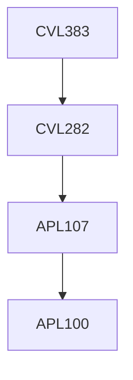

**Credits:** 2 (2-0-0)

**Prerequisites:** [[/Civil Engineering/CVL282|CVL282]]

#### Description
Water Resources Planning Purposes and Objectives; Multi-component, multi-user, multi-objective and multi-purpose attributes of an Integrated Water Resources System; Economic basis for selection of a Plan Alternative; Introduction to Linear Programming and applications in Water Resources Engineering; Linear, Deterministic Integrated Water Resources Management Model on River Basin Scale.

### Prerequisite Tree

