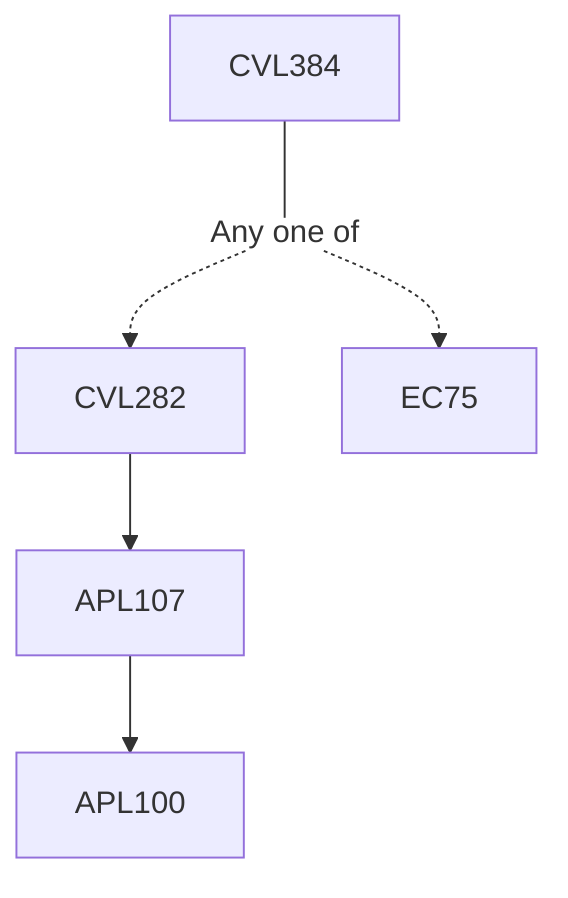

**Credits:** 2 (2-0-0)

**Prerequisites:** [[/Civil Engineering/CVL282|CVL282]] or EC 75

#### Description
Distinctive characteristics of natural and urban watersheds; Urban Heat Island; Changes in rainfall, infiltration and runoff characteristics in urban watershed; IDF relationship and its adaptation for urban settings; Adjusting runoff record for urbanization; Stormwater Management and rainwater harvesting; Urban drainage: layout, structures, flooding and control, combined sewer overflows, sedimentation; Management of stormwater.

### Prerequisite Tree

