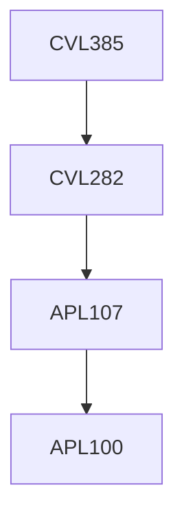

**Credits:** 2 (2-0-0)

**Prerequisites:** [[/Civil Engineering/CVL282|CVL282]]

#### Description
Concepts of probability in Hydrology, Random events, Random variables; moments and expectations; Common probabilistic distributions; goodness of fit tests; Stochastic processes.

### Prerequisite Tree

