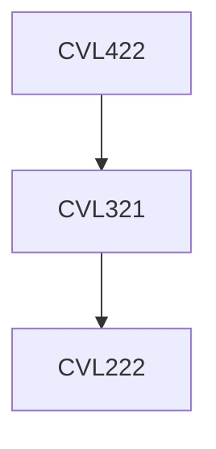

**Credits:** 3 (3-0-0)

**Prerequisites:** [[/Civil Engineering/CVL321|CVL321]]

#### Description
Geological classification, rock and rock mass classification, strength and deformation behaviour of rocks, pore pressures, failure criteria, laboratory and field testing, measurement of in-situ stresses and strains, stability of rock slopes and foundations, design of underground structures, improvement of in situ properties of rock masses and support measures.

### Prerequisite Tree

