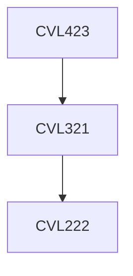

**Credits:** 3 (3-0-0)

**Prerequisites:** [[/Civil Engineering/CVL321|CVL321]]

#### Description
Engineering problems involving soil dynamics; Role of inertia; Theory of Vibrations: Single and two-degree freedom systems; Wave propagation in elastic media; Soil behaviour under cyclic/dynamic loading; Small and large strain dynamic properties of soils; Design criteria for machine foundations; Elastic homogeneous half space and lumped parameter solutions; Vibration isolation; Codal provisions; Causes of Earthquakes; Strong Ground Motion: Measurement, characterization and estimation; Amplification theory and ground response analysis; Liquefaction of soil and its remediation; Seismic slope stability; Seismic bearing capacity and earth pressures

### Prerequisite Tree

