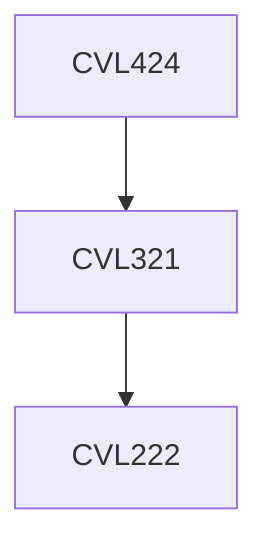

**Credits:** 3 (3-0-0)

**Prerequisites:** [[/Civil Engineering/CVL321|CVL321]]

#### Description
Causes and effects of subsurface contamination; Waste disposal on land; Characteristics of solid wastes; Waste Containment Principles; Types of landfills; Planning of landfills; Design of liners and covers for landfills; Environmental Monitoring around landfills; Detection, control and remediation of subsurface contamination; Geotechnical re-use of solid waste materials.

Types of geosynthetics; Manufacturing; Functions; Testing and evaluation; Designing with geotextiles, geogrids, geonets and geomembranes.

### Prerequisite Tree

