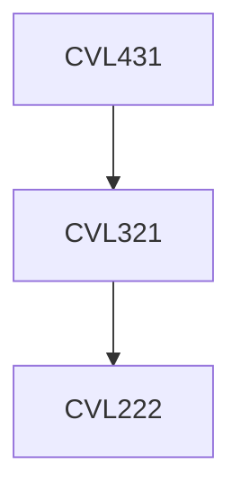

**Credits:** 3 (3-0-0)

**Prerequisites:** [[/Civil Engineering/CVL321|CVL321]]

#### Description
Shallow Foundations: Bearing Capacity, Generalized bearing capacity theory, Empirical methods, Layered soil, Foundations on or near slopes, Settlement of foundations, codal provisions.

Pile Foundations: Types and their selection, Ultimate load of individual piles in compressive, uplift, and lateral loading, Pile load tests, Downdrag, Pile groups. Caissons. Codal provisions.

Earth Retaining Structures: Types, Earth pressures, Design of rigid, flexible and reinforced soil retaining walls, braced excavations, and ground anchors for retaning walls.

Introduction to design of foundation for dynamic loads.

### Prerequisite Tree

