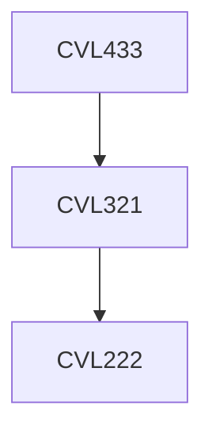

**Credits:** 3 (3-0-0)

**Prerequisites:** [[/Civil Engineering/CVL321 | CVL321]]

#### Description 
Steps in FEM. Stress-deformation analysis: One dimensional, Two dimensional and Three-dimensional formulations. Discretization of a Continuum, Elements, Strains, Stresses, Constitutive, Relations, Hooke’s Law, Formulation of Stiffness Matrix, Boundary Conditions, Solution Algorithms.

Settlement Analysis, 2-D elastic solutions for homogeneous, isotropic medium, Steady Seepage Analysis: Finite element solutions of Laplace’s equation, Consolidation Analysis: Terzaghi consolidation problem, Choice of Soil Properties for Finite Element Analysis, Introduction to PHASE 2.

### Prerequisite Tree

