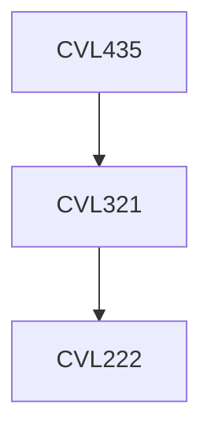

**Credits:** 2 (2-0-0)

**Prerequisites:** [[/Civil Engineering/CVL321|CVL321]]

**Overlaps with:** CVL713

#### Description
Types and classification of underground structures, Functional aspects, Sizes and shapes, Support systems, Design methodology.

Stresses-deformation analysis of openings (circular, elliptical, spherical, ellipsoidal) using analytical and numerical methods.

Design of underground structures using analytical methods, empirical methods and observational methods, Rock support interaction analysis, NATM Hydraulic tunnels, Shafts, Tunnel portals, Metro tunnels.

### Prerequisite Tree

