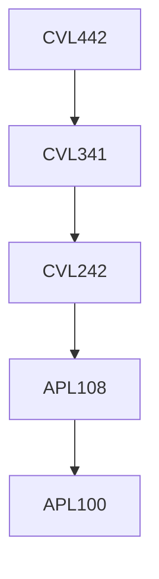

**Credits:** 3 (3-0-0)

**Prerequisites:** [[/Civil Engineering/CVL341 | CVL341]]

#### Description 
Introduction to FEM for structural analysis with review of energy methods-2D plane stress and plane strain elements, beam element, 2D bending element, example problems, elements of structural dynamics-free and forced vibration of SDOF system, treatment of impact and arbitrary loading, frequency and time domain analysis; free vibration mode shapes and frequencies of MDOF systems; normal mode theory for forced vibration analysis of MODF system; example problems. Elements of plastic analysis; upper and lower bound theorems; methods of collapse mechanism; application to beams and multistory frames; example problems.

### Prerequisite Tree

