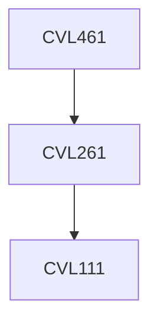

**Credits:** 3 (3-0-0)

**Prerequisites:** [[/Civil Engineering/CVL261|CVL261]] or Instructor’s permission

**Overlaps with:** SML843

#### Description
Evolution of freight and logistics; Interrelationships between society, environment and freight transport; Survey methodologies to understand freight movement; Cost measurement: Production, Holding, Transportation, Handling; Effect of internal and external variables on cost; Demand forecasting; Inventory planning and management; Transportation and distribution network: Design, Development, Management; Ware house operations; Pricing: Perishable, seasonal demand, uncertainty issues; Vehicle routing: One-to-one distribution, One-to-many distribution, Shortest path algorithm, Quickest time algorithm; Logistics information system; Designing and planning transportation networks; Multi-modal transportation issues.

### Prerequisite Tree

