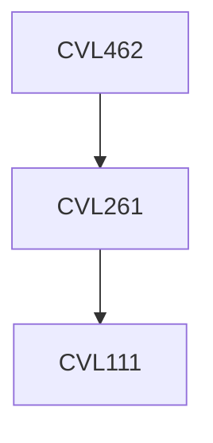

**Credits:** 3 (3-0-0)

**Prerequisites:** [[/Civil Engineering/CVL261 | CVL261]]

#### Description 
Introduction to Intelligent Transportation Systems (ITS); ITS Organizational Issues, the fundamental concepts of Intelligent Transportation Systems (ITS) to students with interest in engineering, transportation systems, communication systems, vehicle technologies, transportation planning, transportation policy, and urban planning. ITS in transportation infrastructure and vehicles, that improve transportation safety, productivity, environment, and travel reliability. Mobile device applications of ITS such as trip planners.

### Prerequisite Tree

