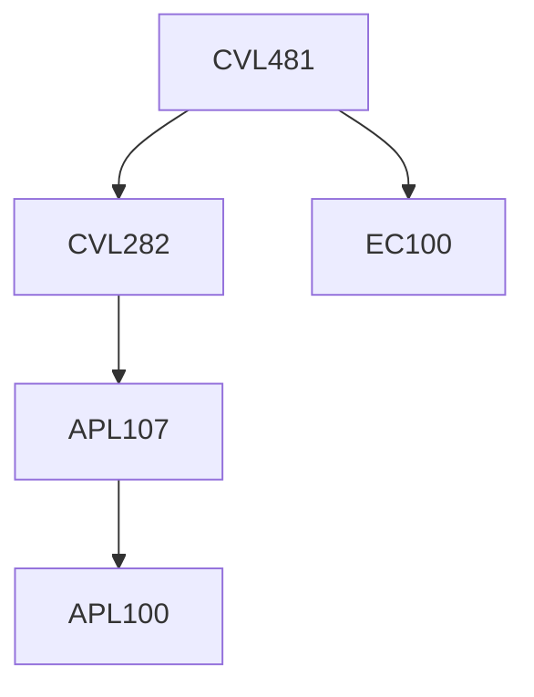

**Credits:** 3 (3-0-0)

**Prerequisites:** [[/Civil Engineering/CVL282|CVL282]] and EC 100

#### Description
Scope of water resources management, Global trends in water utilization, Crop water requirements and irrigation, Planning and desing of various irrigation methods, Soil salinity and water logging, Hydropower systems management, Strom water system management, Economic analysis of water resources projects, Flood Control studies.

### Prerequisite Tree

