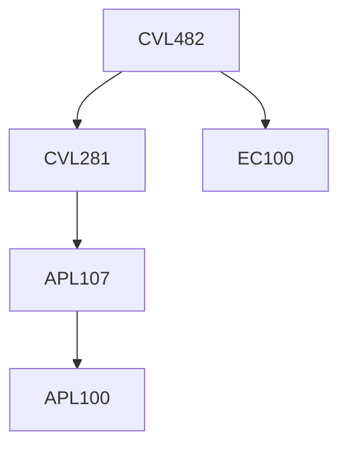

**Credits:** 3 (2-0-2)

**Prerequisites:** [[/Civil Engineering/CVL281|CVL281]] and EC 100

#### Description
Basic principle of hydropower generation, Hydropower Project Planning, Site selection, Hydropower development schemes, Reservoir storage, Assessment of power potential, Hydrologic analysis: Flow duration and load duration curves, Dependable flow, Design flood, Reservoir operation; Hydraulic design of various components of hydropower plants: intakes, hydraulic turbines, conduits and water conveyance, penstock; Performance characteristics of turbines, Specific and unit quantities, Electrical load on hydro-turbines, Power house dimension and planning, Water hammer and surge analysis, Surge tanks, Small and micro hydro power development, tidal plants, Current scenarios in hydropower development, Project feasibility, Impact of hydropower development on water sources systems, environment, socioeconomic conditions and national economy.

### Prerequisite Tree

