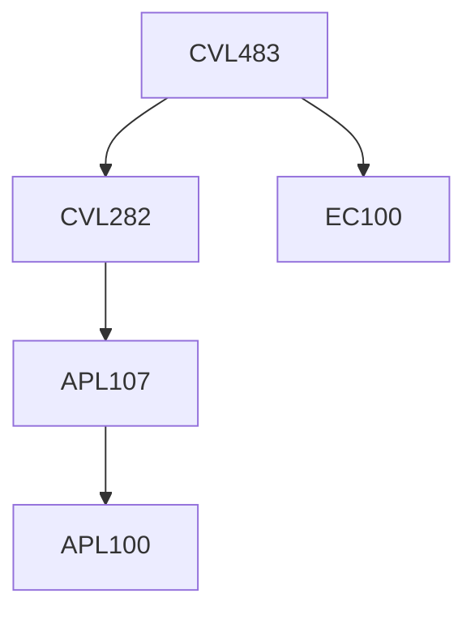

**Credits:** 2 (2-0-0)

**Prerequisites:** [[/Civil Engineering/CVL282 | CVL282]] and EC 100

#### Description 
Groundwater contamination; River and Lake pollution; Pollution sources, Geogenic and anthropogenic pollution; Soil Pollution; Contaminant transport mechanisms; Pollution control, remediation technologies and role of wetlands. Environmental impact assessments, Hydrological impacts, Vulnerability, Case studies.

### Prerequisite Tree

