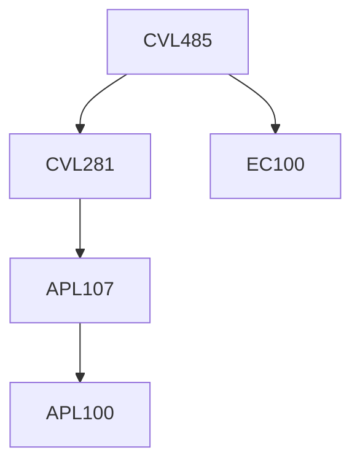

**Credits:** 3 (2-0-2)

**Prerequisites:** [[/Civil Engineering/CVL281|CVL281]] and EC 100

#### Description
Introduction, river morpohology, drainage patterns, stream order. Properties of mixture of sediment and water, Incipient motion and quantitative approach to incipient motion, channel degradation and armoring. Bed forms and resistance to flow, various approaches for bed load transport, suspended load profile and suspended load equations, total load transport including total load transport equations. Comparison and evaluation of sediment transport equations. Stable channel design with critical tractive force theory.

### Prerequisite Tree

