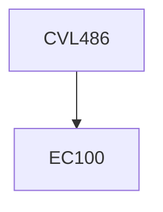

**Credits:** 3 (2-0-2)

**Prerequisites:** EC 100

#### Description
Geospatial and temporal data, Data acquisition, Global positioning system, Global Navigational Satellite System, GPS survey, Aerial and laser scanning surveys, Data acquisition using remote sensing techniques, Sensors and satellite imageries, Stereoscopic 3D viewing, Fly view, Satellite data formats and specifications, Data acquisition for natural resources management and weather forecast, Image processing and interpretation, GIS concepts and Spatial data models, Introduction to microwave remote sensing & LiDAR, Geospatial analysis, DEM/DTM generation & 3D modelling, Inferential statistics, Spatial interpolation, Integrated use of geospatial technologies, Applications and case studies.

### Prerequisite Tree

