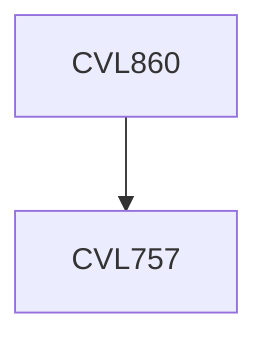

**Credits:** 3 (2-0-2)

**Prerequisites:** [[/Civil Engineering/CVL757|CVL757]]

#### Description
Finite element method (FEM) to solve complex structural engineering problems. Various types of finite elements (FE) considering nonlinear material models; constitutive laws; hybrid elements. Strong and weak form representation and solutions. FEM for dynamic problems: consistent mass matrix, vibration of bars, beams, and plate elements. FEM for buckling problems: geometric matrix, buckling of struts, and plate elements. FE modeling and analysis of complex structures: 3-D frames, shear walls, bridges, cooling towers, continuua etc. Computational aspects: meshing, convergence, singularity, etc. Interpretation of results. Comparison with other methods.

### Prerequisite Tree

