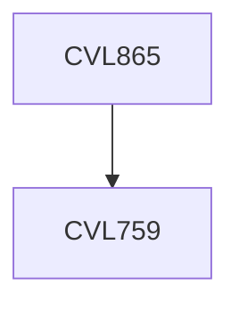

**Credits:** 3 (3-0-0)

**Prerequisites:** [[/Civil Engineering/CVL759|CVL759]]

#### Description
Introduction; Types and classifications; Control theories; Optimal stiffness distributions for building type structures; Role of damping in controlling motion; Active and semi-active systems; Tuned mass dampers - single/ multiple; Quasi-static active control; Passive control: viscous, visco-elastic, friction, hysteretic dampers, base isolation; Nonlinear modeling; Dynamic feedback control; Neural network based control systems; Design for buildings, bridges, power plants, and other structures; Current trends and performance-based design.

### Prerequisite Tree

