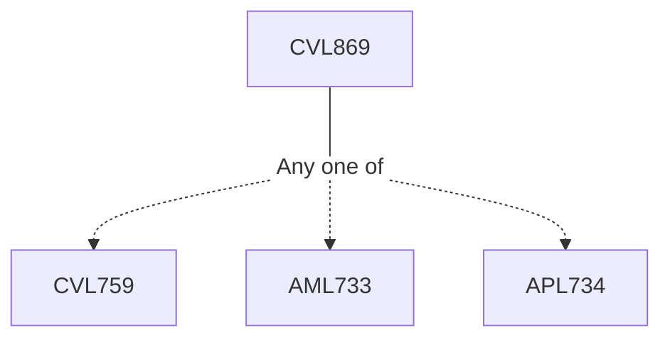

**Credits:** 3 (3-0-0)

**Prerequisites:** [[/Civil Engineering/CVL759|CVL759]]/[[/Applied Mechanics/AML733|AML733]]/[[/Applied Mechanics/APL734|APL734]]

#### Description
Concepts of set theory and probability, random variables and function of random variables, theory of random process, stationary and non-stationary process, expected values, moments, spectral properties of random process, response of linear systems to random excitations, time and frequency domain analysis, SDOF and MDOF systems, structural failure under random vibrations, crossing rates, distribution of local/extreme peaks, first passage probability, application to earthquake and wind engineering, introduction to nonlinear systems, Effect of Parameter Uncertainty, Monte-Carlo simulation.

### Prerequisite Tree

